## 前言

虽然 Windows 推出了 WSL2 ，但是我个人还是倾向于在虚拟机上安装 Linux 系统，原因：

-   虚拟机是完整的操作系统。
-   虚拟机支持多节点部署，并且每个节点都可以拥有不同的配置。
-   如果 WSL2 的使用出现问题，有可能是 WSL2 的问题，也有可能是 Linux 系统的问题。而 VMware 已经相当成熟，基本没有问题。

当然，WSL2 也不是毫无优点。如果要做深度学习的话，可能 WSL2 和硬件的兼容性要好一些。

## VMware 的下载与安装

[下载 VMware Workstation Pro | CN](https://www.vmware.com/cn/products/workstation-pro/workstation-pro-evaluation.html)

下载安装就可以了，激活的话，网上找激活码。不想找激活码就下载社区版。

## 配置虚拟网卡

VMware 提供三种网络模式：桥接模式、主机模式、NAT 模式。

网上关于三种模式的讲解很多了，我个人比较推荐 NAT 模式，一方面我不用管物理机的 ip 变化，另一方面设置代理之后出口的是同一个 ip，所以只占用 1 个设备。NAT 模式可能会有一点性能损失，但非常小。

1.   在 VMware 中选择 【编辑--虚拟网络设置】
     <figure markdown>
     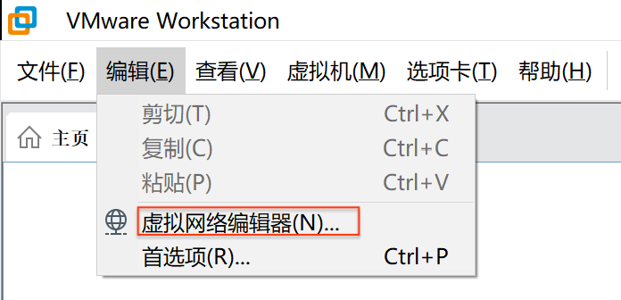{ width="800" }
     </figure>

2.   先选择【更改设置】，以管理员身份继续，对 【VMnet8】进行配置。

     需要配置子网的网段和子网掩码，子网网段只要不和其他网卡的冲突即可，用默认的也行，我这里用的默认的 26 网段。然后勾选【将主机虚拟适配器连接到此网络】 ，同时取消 【使用本地 DHCP 服务将 IP 地址分配给虚拟机】。最后选择 【NAT 设置】

     <figure markdown>
     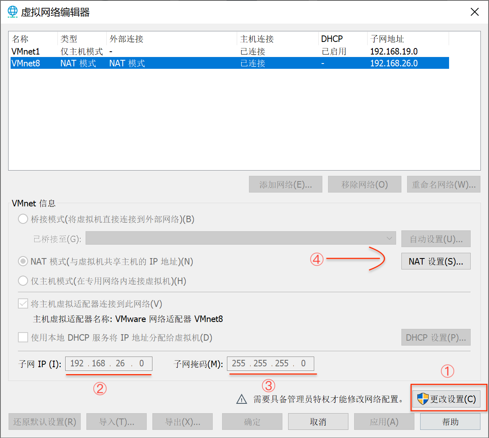{ width="800" }
     </figure>

3.   设置一下网关，一般设置成 1 就可以。

     <figure markdown>
     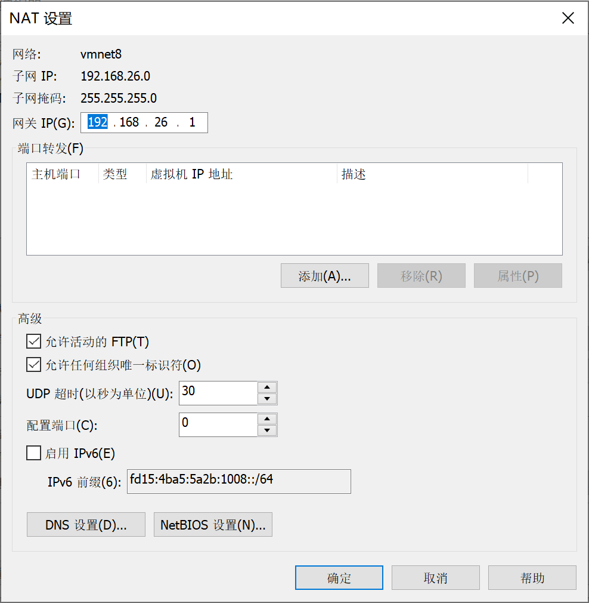{ width="800" }
     </figure>


4.   配置物理机的 VMnet8 网卡 ip，打开网络适配器，设置 ip。

     <figure markdown>
     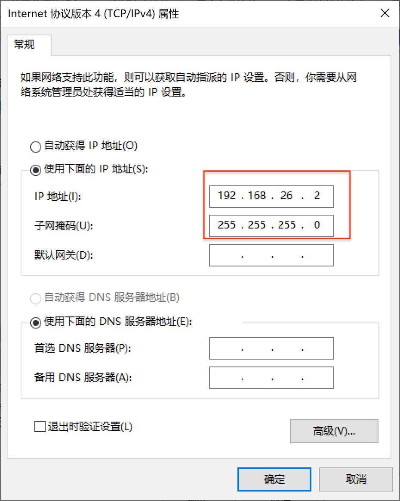{ width="800" }
     </figure>

## Ubuntu 镜像下载

建议选择 Ubuntu。

桌面版（带有GUI）：[Download Ubuntu Desktop | Download | Ubuntu](https://ubuntu.com/download/desktop)

服务器（没有GUI）：[Get Ubuntu Server | Download | Ubuntu](https://ubuntu.com/download/server)

## 创建虚拟机设置

1.   选择 【创建新的虚拟机】  

     <figure markdown>
     { width="800" }
     </figure>

     选择典型就好。

     <figure markdown>
     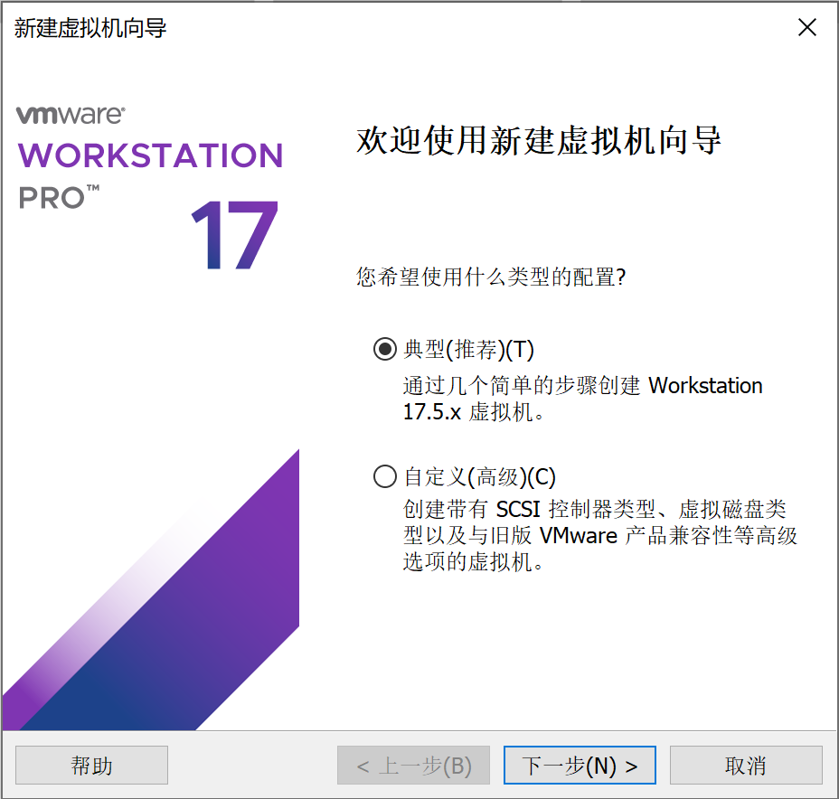{ width="800" }
     </figure>

3.   第二项这里选择刚刚下载的 Ubuntu 镜像，类似于放一个安装用的光盘。

     <figure markdown>
     { width="800" }
     </figure>

4.   设置虚拟机名称，我这里是第二个节点，所以设置成 02。

     <figure markdown>
     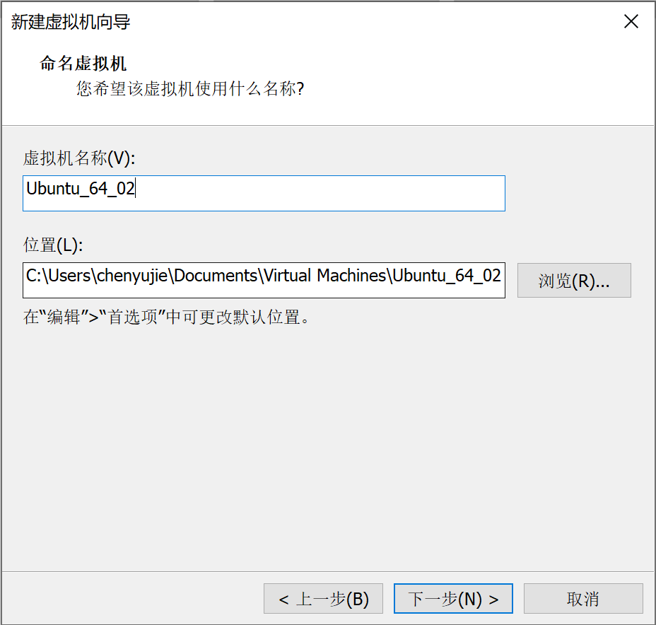{ width="800" }
     </figure>

5.   分配大小，默认的 20GB 太小了，现在最轻量的云服务器都是 40GB 起步。

     <figure markdown>
     { width="800" }
     </figure>

6.   配置完成后选择 【自定义硬件--网络适配器】，选择 【自定义--VMnet8（NAT 模式）】。

     <figure markdown>
     { width="800" }
     </figure>

## Ubuntu 安装与配置

1.   选第一个开始安装。

     <figure markdown>
     { width="800" }
     </figure>

2.   等待一会进入语言选择界面

     <figure markdown>
     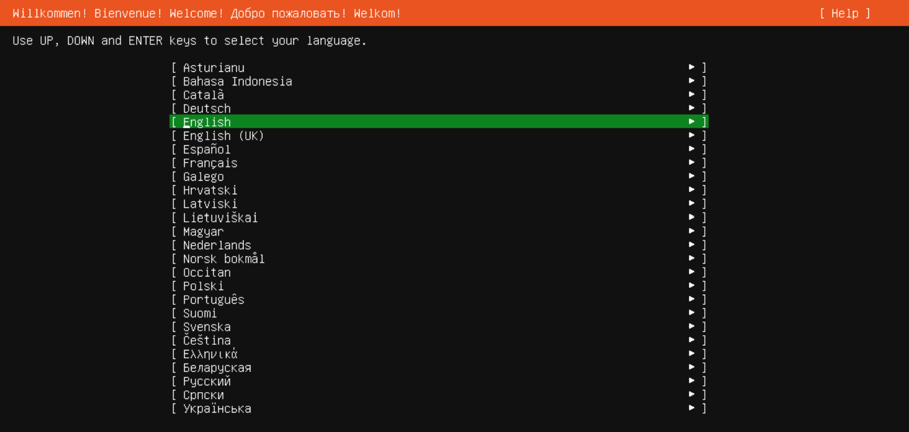{ width="800" }
     </figure>

     然后会跳出确认语言界面。

     <figure markdown>
     { width="800" }
     </figure>

3.   配置网络，手动给系统固定一个 ip，在网卡那里选择 【Edit IPv4】

     <figure markdown>
     { width="800" }
     </figure>

     配置方式选择 【Manual】手动配置，【Subset】表示网段，【Address】表示固定的 ip，Gateway 表示网关，【Name servers】表示 dns，其中 `223.5.5.5` 和 `223.6.6.6` 是阿里云公共 dns。

     【Search domains】可以不设置。

     <figure markdown>
     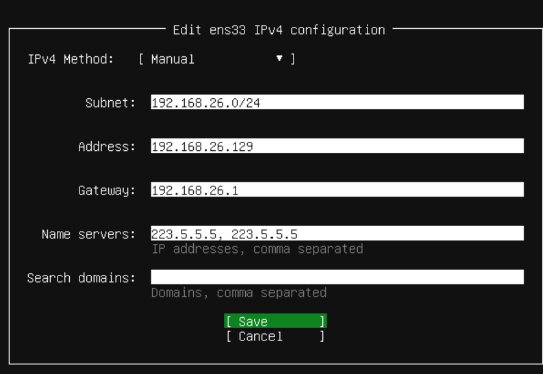{ width="800" }
     </figure>

     配置完成后，只要物理主机有网，则虚拟机就有网。

4.   配置代理选项，如果想让物理主机无条件代理流量的话就填物理主机在 VMnet8 网卡的 ip。我的使用习惯是只在必要的时候开启代理，所以留空。

     <figure markdown>
     { width="800" }
     </figure>

5.   设置镜像源，如果前面网络配置正确，虚拟机有网的话，则会出现下面的提示，默认用的是清华源，所以也不用替换了，省事。如果这里没有提示则虚拟机可能没有网络。

     <figure markdown>
     { width="800" }
     </figure>

6.   是否更新，不想更新就选 continue。

     <figure markdown>
     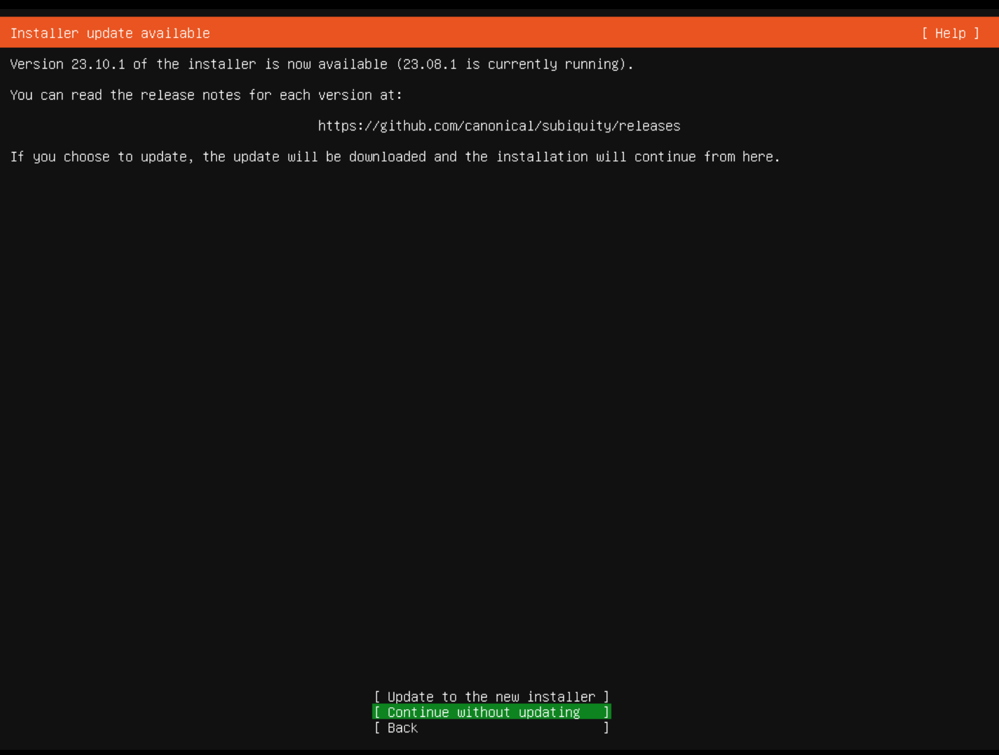{ width="800" }
     </figure>

7.   是否对磁盘分区，看自己的使用习惯，没有分区习惯就不用动。

     <figure markdown>
     { width="800" }
     </figure>

     然后会让你确认磁盘配置的信息。

     <figure markdown>
     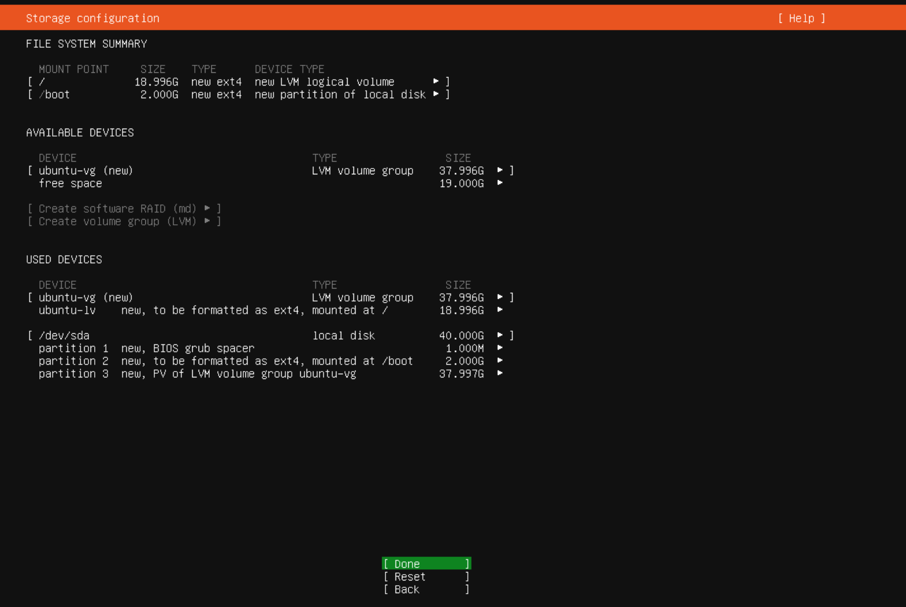{ width="800" }
     </figure>

     确认无误之后选择 Continue。

     <figure markdown>
     { width="800" }
     </figure>

8.   设置用户主机等信息，【Your name】表示开机的时候看到的名字，登录之后就没用了，如果是没有 GUI 的话这个应该是看不到的。【Your server's name】表示主机名，【Pick a username】表示用户名。

     <figure markdown>
     { width="800" }
     </figure>

9.   提示是否升级到 Ubuntu pro，跳过。

     <figure markdown>
     { width="800" }
     </figure>

10.   是否安装 OpenSSH，这个安装之后，后面就不用在 VMware 上用虚拟机了。

     <figure markdown>
     { width="800" }
     </figure>

11.   常见的软件安装，需要哪个就安装哪个。

     <figure markdown>
     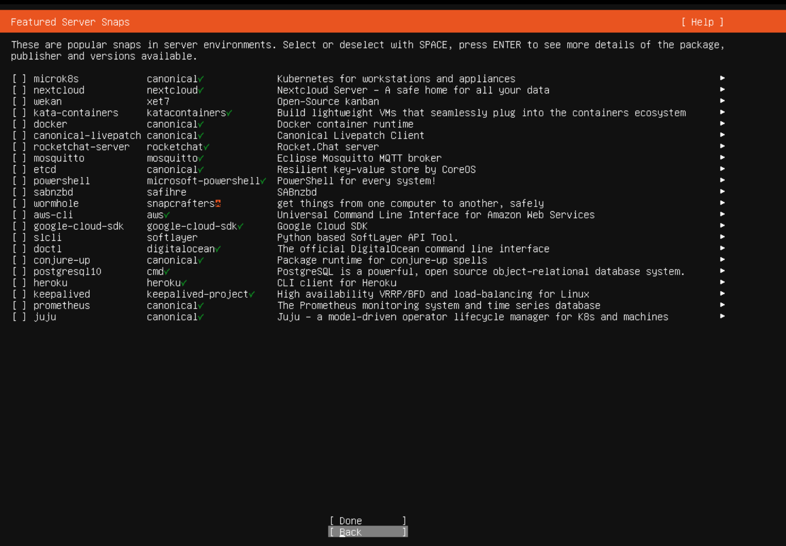{ width="800" }
     </figure>

12.   等待一段时间，安装完成后选择 【Cancel update and reboot】

     <figure markdown>
     { width="800" }
     </figure>

13.   重启的时候会提示需要移除安装媒介。

     <figure markdown>
     { width="800" }
     </figure>

      先关闭虚拟机。

     <figure markdown>
     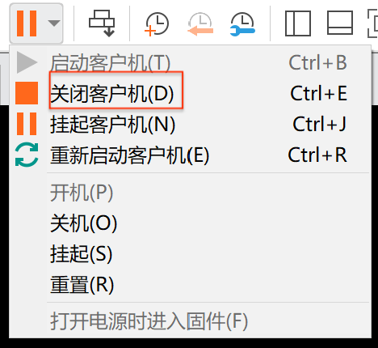{ width="800" }
     </figure>

      在虚拟机设置的【CD/DVD（SATA）】中，改为【使用物理驱动器-自动检测】。

     <figure markdown>
     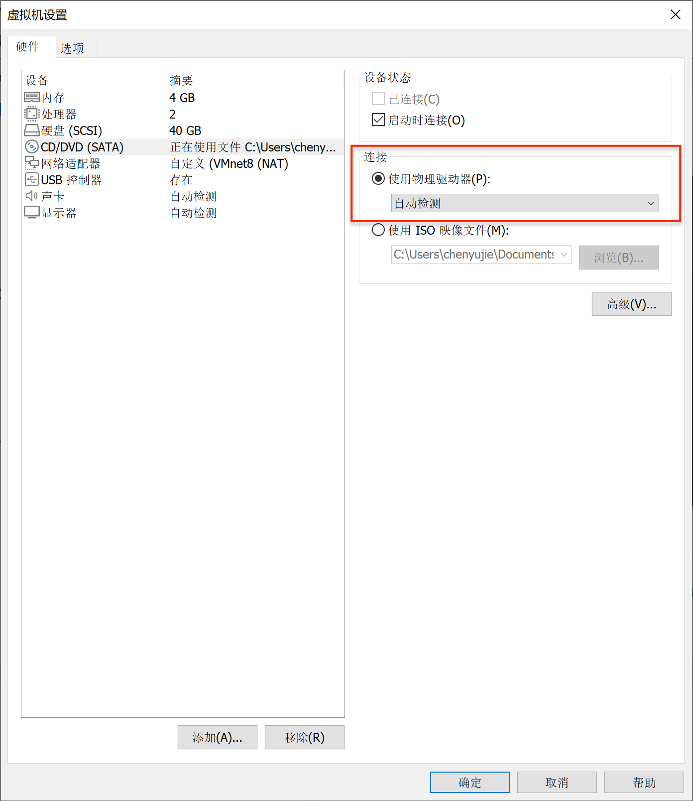{ width="800" }
     </figure>

14.   启动虚拟机，提示找不到连接的 SATA，因为刚刚移除了安装媒介，虚拟机识别不到了。选否就行。

     <figure markdown>
     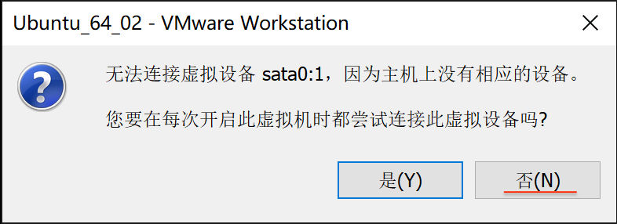{ width="800" }
     </figure>

15.   等待一段时间（可以按回车，如果提示Login表示安装成功），输入用户名和密码，登录成功。

     <figure markdown>
     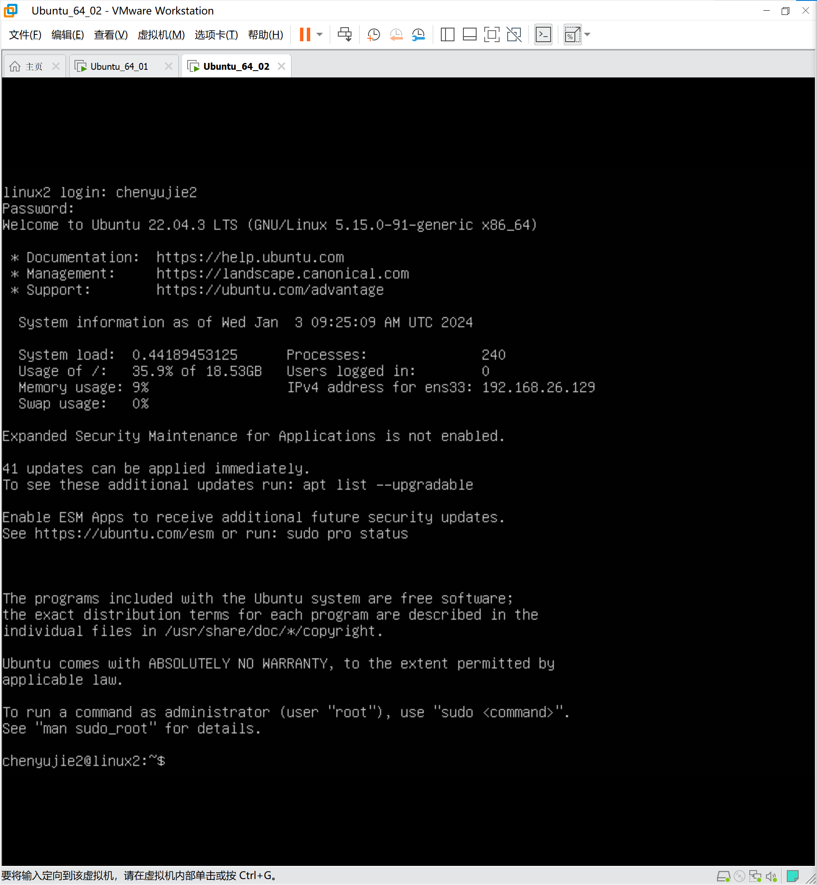{ width="800" }
     </figure>

## 后续设置

### 使用 ssh 登录虚拟机

在 PowerShell 中输入：

``` bash
# 物理机
ssh username@ip
```

输入密码即可登录，后面就不用再 VMware 中操作了。

### 检测虚拟机有没有网

`ping` 一下就好：

```bash
# 虚拟机
ping baidu.com
```

### 修改 root 密码

平时还是用 root 比较多，先修改密码：

```bash
# 虚拟机
sudo passwd root
```

然后切换到 root：

```bash
# 虚拟机
sudo root
```

### 允许 root 用户使用 ssh 登录

需要修改配置文件：

```bash
# 虚拟机
vi /etc/ssh/sshd_config
```

添加这一行即可

```
PermitRootLogin yes
```

然后重启 ssh 服务。

```bash
# 虚拟机
service sshd restart
```

现在可以用 root 用户登录了。

```bash
# 物理机
ssh root@ip
```

### 无需输入 ip 登录

在物理机的 VSCode 中选择左下角的绿色按钮，【连接到主机--配置 SSH 主机】，然后任意选一个配置文件，在其中加入：

```
Host linux2
    HostName 192.168.26.129
    User root
```

这表示使用 `linux2` 代替 `root@192.168.26.129`

现在，无需输入用户名和 ip，输入这条命令即可登录：

```bash
# 物理机
ssh linux2
```

### 免密登录

先生成一个公私钥对：

```bash
# 物理机
ssh-keygen
```

一路回车（表示全默认，会在 `~/.ssh/id_rsa` 目录下生成一对 `RSA` 公私钥，默认长度为 3072）

然后复制公钥的内容

```bash
# 物理机
cd ~/.ssh
ls
cat id_rsa.pub
```

其中 `id_rsa.pub` 表示公钥的内容，`cat` 命令将其打印出来，全部复制即可。

然后登录虚拟机，将公钥的内容加上去。

```bash
# 物理机
ssh linux2
# 虚拟机
vi ~/.ssh/authorized_keys
```

粘贴公钥即可。

现在，无需输入密码即可登录虚拟机。

### 在 VSCode 中 Remote - SSH

-   点击左下角的绿色按钮，连接到虚拟机，选择 Linux 系统即可。
-   `code` 命令的使用。

## Linux 命令行美化

有很多教程，我比较喜欢极简风格，参考 [这个教程](https://gist.github.com/ganapativs/e571d9287cb74121d41bfe75a0c864d7)，虽然这个教程是 Mac 的，但本质都是 Unix 系统。

1.   安装 zsh

     ```bash
     sudo apt install zsh
     ```

2.   安装 oh-my-zsh

     >   可能有点卡，建议挂代理，

     ```bash
     sh -c "$(curl -fsSL https://raw.githubusercontent.com/ohmyzsh/ohmyzsh/master/tools/install.sh)"
     ```

3.   安装 [pure prompt](https://github.com/sindresorhus/pure)，Linux 选择手动安装即可。

4.   安装 `zsh-syntax-highlighting`

     ```bash
     git clone https://github.com/zsh-users/zsh-syntax-highlighting.git ${ZSH_CUSTOM:-~/.oh-my-zsh/custom}/plugins/zsh-syntax-highlighting
     ```

5.   安装 `zsh-autosuggestions`

     ```bash
     git clone https://github.com/zsh-users/zsh-autosuggestions $ZSH_CUSTOM/plugins/zsh-autosuggestions
     ```

6.   修改配置文件：

     ```bash
     code ~/.zshrc
     ```

     ```bash
     plugins=(
         git
         rand-quote
         sudo
         z
         colored-man-pages
         cp
         zsh-syntax-highlighting
         zsh-autosuggestions
     )
     ```

     ```bash
     source ~/.zshrc
     ```

## 扩容磁盘

参考：

-   [LVM : 扩展文件系统的容量 - sparkdev - 博客园 (cnblogs.com)](https://www.cnblogs.com/sparkdev/p/10142629.html)
-   [ubuntu 扩展分区并将剩余空间添加到现有逻辑卷中_ubuntu扩展分区大小 将一个磁盘加到另一个当中-CSDN博客](https://blog.csdn.net/qq_51756940/article/details/130476876#:~:text=使用以下命令打开 parted： sudo parted %2Fdev%2Fsda 打印当前 分区表 ：,分区： (parted) resizepart 3 100% 这将 sda3 分区扩展到最大可能大小。)

1.   首先在 VMware 上扩展硬盘容量。

2.   将增加的容量扩展到分区中。

     ```bash
     parted /dev/sda
     
     # 打印分区表 确定要扩展的分区
     (parted) print 
     
     # 我要扩展的分区是 /dev/sda3
     (parted) resizepart 3 100%
     
     # 打印分区表 查看 /dev/sda3 是否扩展成功
     (parted) print
     
     # 退出
     (parted) q
     ```

​	通过 `lsblk` 也能查看分区大小是否扩展成功。

3.   将 `dev/sda3` 增加的容量扩展到 `VG` 中

     首先确定 `VG` 名，输入 `pvs`，假设输出是

     ```
     PV         VG        Fmt  Attr PSize   PFree
     /dev/sda3  ubuntu-vg lvm2 a--  <38.00g    0
     ```

     则对应的 `VG` 名是 `ubuntu-vg`。

     输入以下命令进行扩展：

     ```bash
     pvresize /dev/sda3
     ```

     再次输入 `pvs`，确定 `PSize` 是否扩展成功。

4.   将 `VG` 增加的容量扩展到 `LV` 中：

     首先确定 `LV Path` ，输入 `lvdisplay`，假设输出是

     ```
     --- Logical volume ---
     LV Path                /dev/ubuntu-vg/ubuntu-lv
     LV Name                ubuntu-lv
     VG Name                ubuntu-vg
     LV UUID                yRSVAA-gKW9-eY6U-owBw-IEHX-4Nes-DJ4ie2
     LV Write Access        read/write
     LV Creation host, time ubuntu-server, 2023-11-14 14:06:32 +0800
     LV Status              available
     # open                 1
     LV Size                <58.00 GiB
     Current LE             14847
     Segments               1
     Allocation             inherit
     Read ahead sectors     auto
     - currently set to     256
     Block device           253:0
     ```
     则对应的 `LV Path` 是 `/dev/ubuntu-vg/ubuntu-lv`。
     
     将 `VG` 增加的所有容量扩展到 `LV` 中：
     
     ```bash
     lvextend -l +100%FREE /dev/ubuntu-vg/ubuntu-lv
     ```
     
     也可以用 `-L` 参数指定具体的大小，例如这条命令会让 `LV` 变成 78G：
     
     ```bash
     lvextend -L 78G /dev/ubuntu-vg/ubuntu-lv
     ```

5.   对 `LV` 执行动态扩容命令

     ```bash
     resize2fs /dev/ubuntu-vg/ubuntu-lv
     ```

6.   搞定，输入 `lsblk` 和 `df -hT` 确定是否成功。

