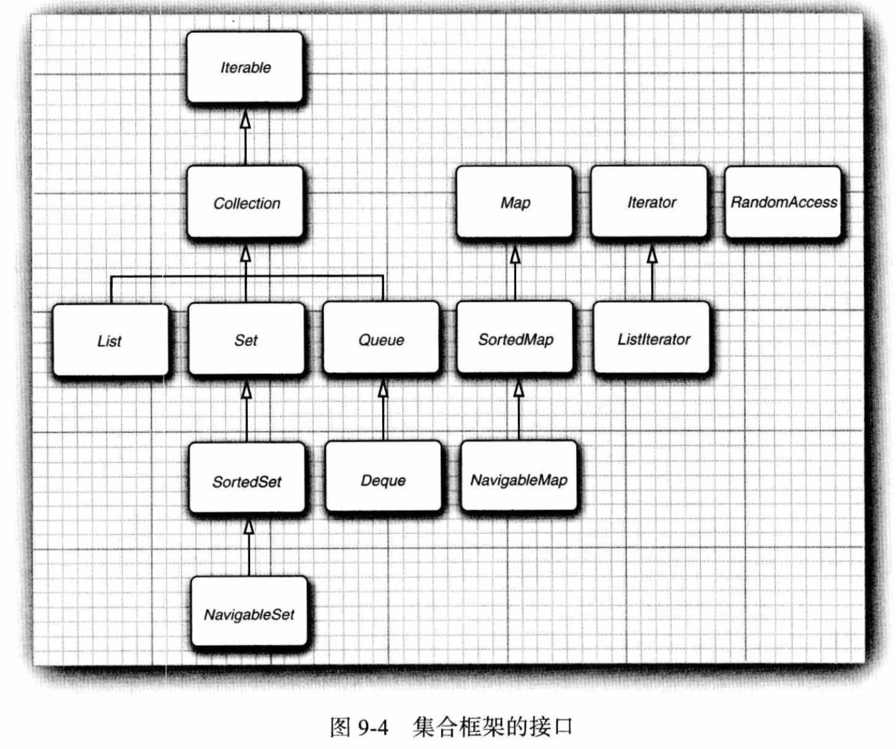

## 集合框架

### 接口之间的关系

### 类之间的关系

## 具体集合

|  `Java` 集合类型  |               底层数据结构               |
| :---------------: | :--------------------------------------: |
|    `ArrayList`    |                 动态数组                 |
|   `Linkedlist`    |                 双向链表                 |
|   `œArrayDeque`   |         双端队列（循环数组实现）         |
|     `HashSet`     |                 哈希集合                 |
|     `TreeSet`     |                  红黑树                  |
|     `EnumSet`     |           包含枚举类型值的集合           |
|  `LinkedHashSet`  |           哈希集合（链表实现）           |
|  `PriorityQueeu`  |                 优先队列                 |
|     `HashMap`     |                  哈希表                  |
|     `TreeMap`     |                  红黑树                  |
|     `EnumMap`     |          键只属于枚举类型值的表          |
|  `LinkedHashMap`  |            哈希表（链表实现）            |
|   `WeakhashMap`   | 哈希表（值没有外部强引用时会被垃圾回收） |
| `IdentityHashMap` |        哈希表（使用 `==` 比较键）        |

### 链表

#### 通用迭代器：Iterator

-   只有实现了 `Iterable` 接口的类才能 `for-each` 遍历，`Iterable` 接口有 `iterator()` 方法返回迭代器类型，也可以用迭代器遍历。
-   `LinkedList` 和 `ArrayList` 的 `Iterator` 位于元素之间的 **间隙** (包括两端元素的左右)。
-   `hasNext()` 方法返回是否有下一个间隙。
-   `next()` 方法会返回当前迭代器的间隙右侧的元素的值，同时将迭代器移动到下一个间隙。

#### 链表专用迭代器：ListIterator

-   `ListIterator` 继承自 `Iterator`，基于双向链表的特性，扩展 `Iterator` 没有实现的功能。
-   `hasPrevious`  方法返回是否有上一个间隙。
-   `previous()` 方法会返回当前迭代器的间隙左侧的元素的值，同时将迭代器移动到上一个间隙。
-   `set()` 方法可以修改 `next` 或 `previous` 访问的上一个元素。
-   `ListIterator` 支持查询当前迭代器的间隙左右两侧元素的索引。

### 动态数组

`ArrayList` 线程不安全，如果要线程安全的动态数组，用 `Vector`

### 哈希表

-   底层数据结构：数组当桶，冲突的元素用链表/红黑树。
-   当链表长度大于 $8$ 且数组长度（桶的数量）超过 

-   默认容量：16。

    
