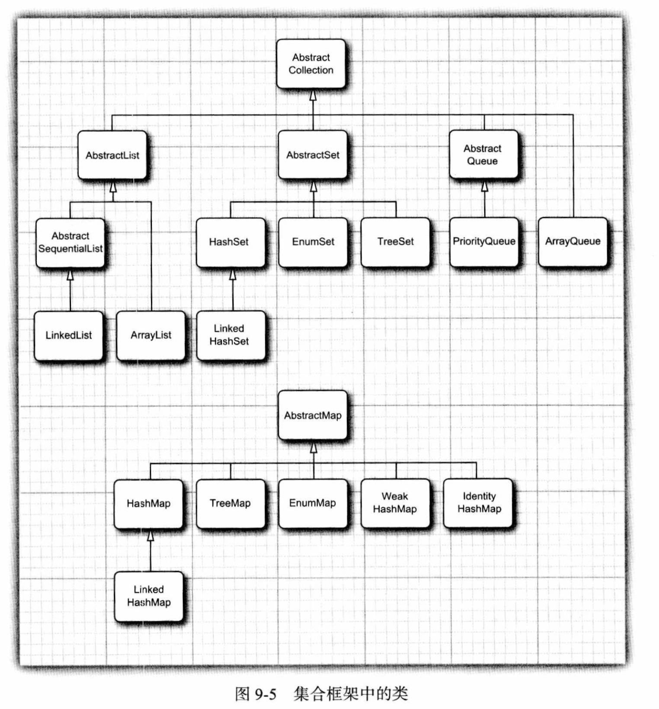

## 集合框架

### 接口之间的关系


### 类之间的关系




## 具体集合

|  `Java` 集合类型  |                底层数据结构                |
| :---------------: | :----------------------------------------: |
|    `ArrayList`    |                  动态数组                  |
|   `Linkedlist`    |                  双向链表                  |
|   `ArrayDeque`    |          双端队列（循环数组实现）          |
|     `HashSet`     |                  哈希集合                  |
|     `TreeSet`     |                   红黑树                   |
|     `EnumSet`     |            包含枚举类型值的集合            |
|  `LinkedHashSet`  |            哈希集合（链表实现）            |
|  `PriorityQueeu`  |                  优先队列                  |
|     `HashMap`     |                   哈希表                   |
|     `TreeMap`     |                   红黑树                   |
|     `EnumMap`     |           键只属于枚举类型值的表           |
|  `LinkedHashMap`  | 哈希表（节点间链表连接，可以记住插入顺序） |
|   `WeakhashMap`   |  哈希表（值没有外部强引用时会被垃圾回收）  |
| `IdentityHashMap` |         哈希表（使用 `==` 比较键）         |

### 链表

#### 通用迭代器：Iterator

-   只有实现了 `Iterable` 接口的类才能 `for-each` 遍历，`Iterable` 接口有 `iterator()` 方法返回迭代器类型，也可以用迭代器遍历。
-   `LinkedList` 和 `ArrayList` 的 `Iterator` 位于元素之间的 **间隙** (包括两端元素的左右)。
-   `hasNext()` 方法返回是否有下一个间隙。
-   `next()` 方法会返回当前迭代器的间隙右侧的元素的值，同时将迭代器移动到下一个间隙。

#### 链表专用迭代器：ListIterator

-   `ListIterator` 继承自 `Iterator`，基于双向链表的特性，扩展 `Iterator` 没有实现的功能。
-   `hasPrevious`  方法返回是否有上一个间隙。
-   `previous()` 方法会返回当前迭代器的间隙左侧的元素的值，同时将迭代器移动到上一个间隙。
-   `set()` 方法可以修改 `next` 或 `previous` 访问的上一个元素。
-   `ListIterator` 支持查询当前迭代器的间隙左右两侧元素的索引。

### 动态数组

`ArrayList` 线程不安全，如果要线程安全的动态数组，用 `Vector`

### 哈希表

哈希表的 `K` 必须重写 `hashCode()` 方法和 `equals()` 方法。最好加上 `@override` 标记提醒自己。

-   [HashMap源码分析](../SourceCode/HashMap.md)

### 红黑树

使用红黑树 `TreeSet` 和 `TeeeMap` 的 `K` 必须实现 `Comparable<T>` 接口，或者 `Comparator` 接口。

### 队列

队列 `Queue<T>` 和双端队列 `Deque<T>` 是接口，`ArrayQueue<T>` 和 `LinkedList<T>` 都实现了这两个接口，其中 `ArrayQueue<T>` 是基于循环队列的实现，`LinkedList<T>` 是基于双向链表的实现。 

队列的方法及其比较：

|       方法名       |         描述         |           异常行为           |
| :----------------: | :------------------: | :--------------------------: |
|  `boolean add(E)`  |   将元素 `E` 入队    |   如果队列已满，会抛出异常   |
|    `E remove()`    | 将队头元素出队并返回 |   如果队列为空，会抛出异常   |
|   `E element()`    |     返回队头元素     |   如果队列为空，会抛出异常   |
| `boolean offer(E)` |   将元素 `E` 入队    | 如果队列已满，会返回 `false` |
|     `E poll()`     | 将队头元素出队并返回 | 如果队列已满，会返回 `null`  |
|     `E peek()`     |     返回队头元素     | 如果队列已满，会返回 `null`  |

### 优先队列

和红黑树一样， 必须实现 `Comparable<T>` 接口，或者 `Comparator` 接口。

## TreeMap 和 HashMap 补充

-   `Java` 的红黑树迭代器不太灵活，不能像 `C++ STL` 那样二分出迭代器，只能二分出键值对。而且在迭代之前就要想清楚到底是只要值还是键值都要。
-   两种 `Map` 都不能用范围 `for`，可以用 `forEach()` 方法，参数是函数式接口，例如 `map.forEach((k, v) -> System.out.println("key=" + k + ", value=" + v));` 或者得到视图再开始枚举。
-   不能像 `C++` 中 `map[key]++`，这种情况要用 `merge()` 方法。

## 算法

### 排序

`Arrays.sort()` 用于对数组排序，而如果要对 `ArrayList` 或者 `LinkedList` 排序，则需要调用对象的 `sort()` 方法。

`sort()` 方法是稳定排序。

前置代码：一个简单的 `Pair` 泛型类

```java
class Pair<F extends Comparable<F>, S extends Comparable<S>> implements Comparable<Pair<F, S>> {
    private F first;
    private S second;

    public Pair(F f, S s) {first = f; second = s;}

    public F getFirst() {return first;}

    public S getSecond() {return second;}

    public void setFirst(F f) {first = f;}

    public void setSecond(S s) {second = s;}

    @Override
    public int compareTo(Pair<F, S> o) {
        int d = first.compareTo(o.first);
        return d != 0 ? d : second.compareTo(o.second);
    }

    @Override
    public String toString() {return "[" + first + ", " + second + "]";}
}
public class Main {
    public static void main(String[] args) {
        ArrayList<Pair<Integer, Integer>> a = new ArrayList<>();
		... // 给 a 添加数据
    }
}
```

下面开始介绍 `a.sort()` 方法，函数参数接受一个 `Comparator` 接口：

```java
// 不要用 a.sort(null), 用 Comparator.naturalOrder() 可以提醒是否实现了 Comparable 接口
a.sort(Comparator.naturalOrder()); // 用 compareTo() 比较
a.sort(Comparator.reverseOrder()); // 逆序
a.sort(Comparator.comparing(Pair::getSecond)); // 用 getSecond() 比较
a.sort(Comparator.comparing(Pair::getSecond, Comparator.reverseOrder())); // 用 getSecond() 比较，逆序
a.sort(Comparator.comparing(Pair<Integer, Integer>::getSecond, Comparator.reverseOrder())
    .thenComparing(Pair::getFirst)); // 先比较 getSecond() 降序，如果相同就比较 getFirst() 升序 注意这种情况要注明 Pair类型

a.sort(Comparator.comparing(p -> p.getFirst() + p.getSecond())); // 使用 lambda 表达式比较 getFirst() + getSecond()
```

### 洗牌

使用 `Collections.shuffle() ` 对 `ArrayList` 类型随机打乱：
```java
var numbers = new ArrayList<Integer>();
for (int i = 1; i <= 49; i++)
    numbers.add(i);
Collections.shuffle(numbers);
```

### 二分查找

`Collections.binarySearch()` 查找一个元素是否出现在表中：

```java
var numbers = new ArrayList<Integer>();
for (int i = 0; i <= 13; i++)
    numbers.add(i);
for (int i = 15; i <= 49; i++)
    numbers.add(i);
int pos = Collections.binarySearch(numbers, 14) // pos = -14
System.out.println(pos);
```

如果返回负数表示查询失败，`-pos-1` 表示这个元素应该插入的位置。

如果返回证书表示查询成功，`pos` 表示元素的位置。

`Java` 中没有类似 `C++` 的 `lower+bound()` 方法。